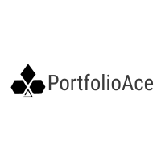

<!--This awesome README template can be found on https://github.com/othneildrew/Best-README-Template -->

[![Stargazers][stars-shield]][stars-url]
[![Issues][issues-shield]][issues-url]
[![GPL-3.0][license-shield]][license-url]


<!-- PROJECT LOGO -->
<br />
<p align="center">
  <a href="https://github.com/RamonWill/PortfolioAce">
    
  </a>

  <p align="center">
    A fund administration application created in C#. Currently in pre-alpha stage
    <br />
    <br />
    <a href="">View Demo</a>
    ·
    <a href="https://github.com/RamonWill/PortfolioAce/issues">Report Bug</a>
    ·
    <a href="https://github.com/RamonWill/PortfolioAce/issues">Request Feature</a>
  </p>
</p>


<!-- TABLE OF CONTENTS -->
<details>
  <summary>Table of Contents</summary>
  <ol>
    <li>
      <a href="#about-the-project">About PortfolioAce</a>
      <ul>
        <li><a href="#built-with">Built With</a></li>
      </ul>
    </li>
    <li>
      <a href="#getting-started">Getting Started</a>
      <ul>
        <li><a href="#prerequisites">Prerequisites</a></li>
        <li><a href="#installation">Installation</a></li>
      </ul>
    </li>
    <li><a href="#roadmap">Roadmap</a></li>
    <li><a href="#contributing">Contributing</a></li>
    <li><a href="#license">License</a></li>
    <li><a href="#contact">Contact</a></li>
    <li><a href="#acknowledgements">Acknowledgements</a></li>
    <li><a href="#screenshots">Screenshots</a></li>
  </ol>
</details>


<!-- ABOUT THE PROJECT -->
## About The Project
<p align="center">
  
</p>

During my programming journey I have wanted to apply my knowledge and experience in the financial industry with the various resources available to me. This project (PortfolioAce) is currently a work in progress but i eventually hope for it to become a complete open source portfolio management solution for anyone.

Features:
* Valuation and performance calculations for FX Forwards, Equities and Cryptocurrencies.
* Management and Performance fee calculations taking the Hurdle rate (soft or hard) and/or High-Water Mark into consideration.  
* Lock and Unlock Accounting Periods
* Data Metrics at a fund and position level.
* Export data to CSV, TXT or JSON files.

As this is currently a work in progress i still need to implement testing and create more flexibility around these features.

### Built With

The UI was written in XAML using the WPF Framework and the Business Logic is written in C# using .NET Core 3.1. This application relies on SQLite for storage.

<!-- GETTING STARTED -->
## Getting Started

To get a local copy up and running follow these simple example steps.

### Prerequisites

This is an example of how to list things you need to use the software and how to install them.
All dependencies are available via the NuGet package manager:
* LiveCharts
* ServiceStack
* CsvHelper
* DataGridExtensions
* MaterialDesignThemes
* MaterialDesignExtension
* Entity Framework Core (3.1.9)
* Entity Framework Core Tools (3.1.9)
* Entity Framework Core Sqlite (3.1.9)


### Installation

1. Clone the repository
   ```sh
   git clone https://github.com/RamonWill/PortfolioAce.git
   ```
2. Install the dependencies via NuGet

In order to get security prices this application relies on Alpha Vantage. The eventual goal is for this application to also support the services offered by Financial Modelling Prep. Free API Keys for these data providers can be found below:
* [AlphaVantage](https://www.alphavantage.co/)
* [Financial Modelling Prep](https://financialmodelingprep.com/)


<!-- ROADMAP -->
## Roadmap
Coming Soon
<!-- See the [open issues](https://github.com/RamonWill/PortfolioAce/issues) for a list of proposed features (and known issues). -->


<!-- CONTRIBUTING -->
## Contributing

A lot of things need to be implemented all whilst I learn best practices and system design. All contributions no matter how small are greatly appreciated.

1. Fork the Project
2. Create your Feature Branch (`git checkout -b feature/AmazingFeature`)
3. Commit your Changes (`git commit -m 'Add some AmazingFeature'`)
4. Push to the Branch (`git push origin feature/AmazingFeature`)
5. Open a Pull Request


<!-- LICENSE -->
## License
Distributed under the GNU General Public License v3. See `LICENSE` for more information.


<!-- CONTACT -->
## Contact
Project Link: [https://github.com/RamonWill/PortfolioAce](https://github.com/RamonWill/PortfolioAce)


<!-- ACKNOWLEDGEMENTS -->
## Acknowledgements
* [Icons8](https://icons8.com/)
* [Img Shields](https://shields.io)
* [Free Logo Design](https://www.freelogodesign.org)
* [SingletonSean YT](https://www.youtube.com/channel/UC7X9mQ_XtTYWzr9Tf_NYcIg)
* [DataGridExtensions](https://github.com/dotnet/DataGridExtensions)
* [Material Desing in XAML](http://materialdesigninxaml.net/)
* [WPF AutoComplete TextBox](https://github.com/quicoli/WPF-AutoComplete-TextBox)


<!-- Screenshot -->
## Screenshots

<br />

<br />


<!-- MARKDOWN LINKS & IMAGES -->
[stars-shield]: https://img.shields.io/github/stars/RamonWill/PortfolioAce.svg?style=for-the-badge
[stars-url]: https://github.com/RamonWill/PortfolioAce/stargazers
[issues-shield]: https://img.shields.io/github/issues/RamonWill/PortfolioAce.svg?style=for-the-badge
[issues-url]: https://github.com/RamonWill/PortfolioAce/issues
[license-shield]: https://img.shields.io/github/license/RamonWill/PortfolioAce.svg?style=for-the-badge
[license-url]: https://github.com/RamonWill/PortfolioAce/blob/master/LICENSE.txt
